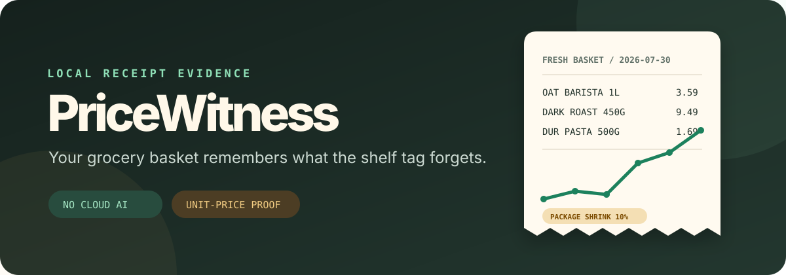
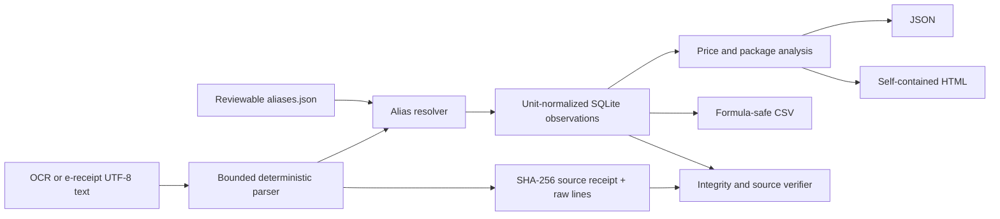

<p align="center">
  
</p>

<p align="center">
  <a href="https://github.com/KanadeK/pricewitness/actions/workflows/ci.yml"></a>
  <a href="https://github.com/KanadeK/pricewitness/releases/latest"></a>
  <a href="LICENSE"></a>
  <a href="https://www.python.org/"></a>
</p>

<p align="center"><strong>Turn terse grocery receipt text into an auditable unit-price history — locally, deterministically, and without cloud AI.</strong></p>

[Live demo](https://kanadek.github.io/pricewitness/) · [简体中文](README.zh-CN.md) · [Research and gap analysis](docs/RESEARCH.md) · [Troubleshooting](docs/TROUBLESHOOTING.md)

## Why PriceWitness exists

Receipt OCR gives you text. Inventory apps know what is in the pantry. Budget apps know the transaction total. The missing layer is the difficult one: proving that `DK COFFEE 450 G`, `DARK COFFEE 500G`, and a store-specific abbreviation are the same product, then comparing the price on a common unit without silently guessing.

PriceWitness is that post-OCR evidence layer. It:

- parses UTF-8 receipt text into immutable, SHA-256-addressed source records;
- maps store shorthand through a small, reviewable JSON alias book;
- normalizes `kg`, `g`, `lb`, `oz`, `L`, `ml`, fluid ounces, and count units;
- detects price spikes and package shrink while preserving the raw descriptor;
- refuses ambiguous identity matches and emits a review queue;
- generates a self-contained HTML report, deterministic JSON, and formula-safe CSV;
- verifies SQLite integrity, arithmetic, foreign keys, and optional original file hashes.

It is not another receipt inbox, household ERP, OCR service, or retailer scraper. The [research snapshot](docs/RESEARCH.md) records the searches and adjacent projects that shaped this boundary.

## See it work in one command

```bash
python -m venv .venv
# Windows: .venv\Scripts\python -m pip install -e .
# macOS/Linux: .venv/bin/python -m pip install -e .

pricewitness demo --output .demo
```

The synthetic demo creates:

```text
.demo/
├── aliases.json
├── analysis.json
├── demo-manifest.json
├── observations.csv
├── pricewitness.db
├── report.html
└── receipts/
```

Expected v0.1.0 summary:

```json
{
  "receipt_count": 3,
  "observation_count": 16,
  "mapped_count": 15,
  "review_count": 1,
  "alert_count": 5,
  "basket_change_percent": 14.87
}
```

Open `.demo/report.html` in any browser. It makes no network requests. One synthetic jam descriptor is intentionally unresolved so the review workflow is visible.

## Real workflow

PriceWitness accepts OCR output or electronic-receipt text as UTF-8 files. It intentionally keeps OCR outside the trusted core: use your scanner, Tesseract, OCRmyPDF, Paperless-ngx, or a store export, then review the text before ingestion.

```bash
pricewitness init groceries.db

pricewitness ingest groceries.db receipts/*.txt \
  --aliases aliases.json \
  --currency USD

pricewitness analyze groceries.db --output analysis.json
pricewitness report groceries.db --output price-report.html
pricewitness export groceries.db --output observations.csv

pricewitness verify groceries.db receipts/*.txt
```

On PowerShell, pass the source paths explicitly if your shell does not expand a wildcard:

```powershell
pricewitness verify groceries.db `
  receipts\receipt-2026-01-12.txt `
  receipts\receipt-2026-03-18.txt
```

### Supported receipt lines

The generic parser recognizes these forms:

```text
OAT BARISTA 1L                  $3.49
BANANAS 1.20 KG @ 1.29/KG      $1.55
2 x DUR PASTA 500 G @ $1.69    $3.38
SUBTOTAL                       $8.42
TAX                            $0.00
TOTAL                          $8.42
```

Input limits are 2 MB, 10,000 lines, and 1,000 characters per line. Receipt text is data, never code: PriceWitness does not evaluate templates, formulas, Python, or user-provided regular expressions.

## Make shorthand reviewable

An alias book is ordinary JSON. Exact, contains, and glob matches are supported; arbitrary regular expressions are deliberately excluded.

```json
{
  "schema_version": 1,
  "products": [
    {
      "key": "oat-milk-barista",
      "name": "Oat milk, barista",
      "category": "dairy alternatives",
      "aliases": [
        {
          "pattern": "OAT BRT 1 L",
          "match": "exact",
          "merchant": "*",
          "package": "1 L"
        }
      ]
    }
  ]
}
```

Add a rule atomically, validate it, and rematch existing evidence:

```bash
pricewitness aliases add aliases.json \
  --product-key local-jam \
  --product-name "Local jam" \
  --category pantry \
  --pattern "LOCAL JAM 250G" \
  --package "250 g"

pricewitness aliases validate aliases.json
pricewitness rematch groceries.db --aliases aliases.json
```

Rematching changes only derived identity fields. Original receipt hashes, raw lines, dates, and amounts remain intact.

## What the analysis means

| Signal | Rule in v0.1.0 | Evidence boundary |
|---|---|---|
| Price spike | Adjacent mapped unit price rises at least 10% | Your supplied receipts only |
| Package shrink | Base amount falls at least 5% while total price remains at least 95% of the previous total | Same mapped product and base unit |
| Basket change | First-spend-weighted change across products with comparable first/latest unit prices | Not CPI and not a market estimate |
| Best current store | Lowest latest observed unit price among merchants | Not a live shelf-price claim |
| Unit conflict | One canonical product maps to incompatible base units | Review required; comparison is withheld |

Thresholds are explicit:

```bash
pricewitness analyze groceries.db --spike-threshold 15 --shrink-threshold 8
```

## Privacy and safety defaults

- No telemetry, accounts, cookies, remote fonts, CDNs, or API calls.
- Only the source basename is stored; absolute local paths are not persisted.
- HTML escapes every receipt-derived value and embeds no source receipt body.
- CSV cells beginning with `=`, `+`, `-`, or `@` are neutralized.
- SHA-256 prevents duplicate ingestion and supports later source verification.
- SQLite statements are parameterized and foreign keys are enforced.
- Unknown and tied mappings stay unresolved instead of becoming invented facts.

Receipts can contain names, loyalty IDs, card suffixes, addresses, and purchase habits. Keep the database and originals private. Read [SECURITY.md](SECURITY.md) before sharing a report or opening an issue.

## Acceptance commands

These are the release gates used by CI and the v0.1.0 release:

```bash
python -m pip install -e ".[dev]"
python -m ruff format --check .
python -m ruff check .
python -m mypy
python -m pytest
python scripts/release_check.py
```

The expected test gate is at least 90% branch coverage. `release_check.py` also builds the wheel/sdist/demo bundle twice and byte-compares every asset, runs Twine metadata and checksum checks, installs the wheel into a clean environment, runs the packaged demo, checks its source hashes, and scans repository text for high-risk secret patterns.

## If a command fails

Start with the machine-readable exit status and preserve the evidence:

- exit `1` from `verify`: integrity or hash failure; do not overwrite the original source;
- exit `2`: invalid input, alias schema, filesystem access, or SQLite error;
- `review` is not a failure: add a narrow alias, validate, then `rematch`;
- subtotal warnings are retained because coupons, deposits, and tax rounding differ by store.

The exact diagnosis and repair commands are in [docs/TROUBLESHOOTING.md](docs/TROUBLESHOOTING.md). The guide never recommends deleting a ledger as the first repair step.

## Architecture



See [docs/ARCHITECTURE.md](docs/ARCHITECTURE.md) and [docs/DATA_FORMATS.md](docs/DATA_FORMATS.md) for module and schema details.

## Scope and roadmap

v0.1.0 is deliberately post-OCR and single-currency-per-comparison. It does not claim item identity without an alias, infer nutrition, scrape retailers, upload receipts, or make economic/legal advice.

Good next contributions:

- opt-in merchant profiles for common text layouts;
- import adapters for Paperless-ngx, Receipt Wrangler, and Grocy;
- a local alias-review TUI that edits the same JSON contract;
- more locale-aware money/date parsing with fixture-backed behavior;
- signed alias packs with provenance and collision tests.

Read [CONTRIBUTING.md](CONTRIBUTING.md) before adding a parser rule. Every new rule needs a synthetic fixture and a false-positive test.

## License

MIT. Synthetic demo stores and products are fictional.
