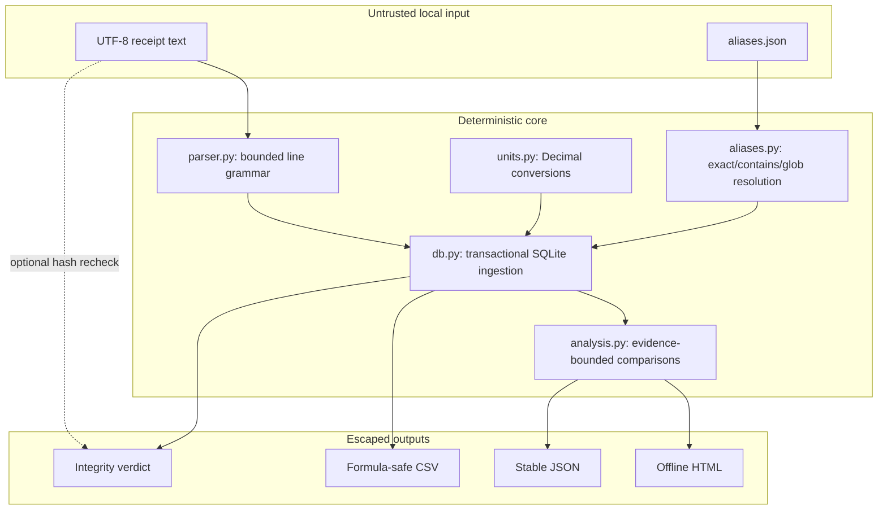

# Architecture

PriceWitness separates source evidence from derived interpretation. An alias update can improve mappings without rewriting what the receipt said.

## Boundaries

## Modules

- `parser.py` recognizes bounded, fixture-backed line forms. It does not execute configurable regex.
- `aliases.py` validates product keys and rules, gives merchant-specific rules precedence, and reports equal-ranked cross-product matches as ambiguous.
- `units.py` converts with `Decimal`, preserving grams, millilitres, or count as the base domain.
- `db.py` stores source receipt hashes/raw lines separately from derived observations. Ingestion is idempotent by SHA-256.
- `analysis.py` compares only mapped observations with compatible base units.
- `report.py` escapes every dynamic value and embeds only structured analysis, not full receipt text.
- `exporter.py` neutralizes spreadsheet formula prefixes.
- `verify.py` checks SQLite integrity, foreign keys, schema version, stored arithmetic, hash shape/uniqueness, and optional source file bytes.
- `demo.py` proves the package includes enough real behavior to create a complete ledger/report without network access.

## Trust invariants

1. Raw source hash, source basename, raw line, date, and amount are never modified by `rematch`.
2. A product identity is either backed by one highest-ranked rule or remains unresolved.
3. Cross-unit comparisons are withheld rather than coerced.
4. Duplicate byte-identical receipts do not create duplicate observations.
5. Reports and exports treat receipt-derived strings as untrusted.

## Schema evolution

The SQLite schema and analysis JSON each have an explicit version. v0.1.0 rejects an unknown database schema instead of applying a guessed migration. Future migrations must be transactional, fixture-backed, and reversible from a pre-migration copy.
